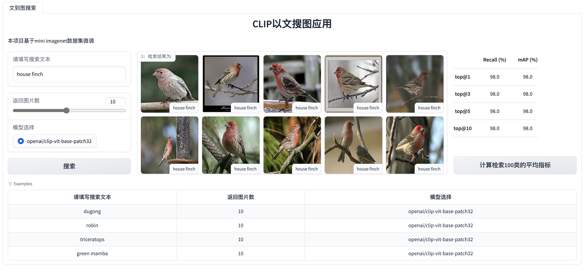

# 多模态大模型图像检索



## 项目概述

该项目是一个基于 OpenAI 的 CLIP
模型的应用，旨在通过输入文本描述来检索与之相匹配的图片。它结合了 `CLIP`
模型的强大图像和文本理解能力，使得用户可以通过简单的文本查询来发现感兴趣的图片。为了提高检索效率，项目采用了 `Milvus`
和 `Redis` 数据库，并利用 `ONNX` 进行推理加速。

## 主要功能

1. **图文检索**：用户可以输入文本描述，系统将利用 CLIP 模型从数据库中检索出与之最匹配的图片，并返回结果。

2. **索引技术**：项目使用 Milvus 数据库来存储图像特征向量，利用其高效的相似度搜索功能进行图像检索。

3. **缓存优化**：通过 Redis 数据库，将一部分检索结果缓存在内存中，以加速后续的相似度搜索。(可选功能)

4. **ONNX 推理加速**：通过将 CLIP 模型转换为 ONNX 格式，利用 ONNX Runtime 进行推理加速，提高检索的实时性。

## 安装指南

在这里提供项目的安装指南：

1. 下载安装单机版`milvus`向量数据库 https://milvus.io/docs/install_standalone-docker.md

```bash
$ wget https://github.com/milvus-io/milvus/releases/download/v2.2.12/milvus-standalone-docker-compose.yml -O docker-compose.yml
$ sudo docker-compose up -d
$ docker port milvus-standalone 19530/tcp
```

2. 下载安装redis (可选功能)

```bash
$ sudo apt-get install redis-server
```

2. 安装所需依赖项：

```bash
$ git clone https://github.com/sjy0727/CLIP-Text-Image-Retrieval.git
$ cd ./CLIP-Text-Image-Retrieval
$ pip install -r requirements.txt
```

## 数据集准备

### 数据集介绍

2016年google
DeepMind团队从Imagnet数据集中抽取的一小部分（大小约3GB）制作了Mini-Imagenet数据集，共有100个类别，每个类别都有600张图片，共60000张，而且图像大小不定。

### 数据集下载

- 下载`mini-imagenet` [数据集](https://pan.baidu.com/s/1Uro6RuEbRGGCQ8iXvF2SAQ/?pwd=hl31)。


- 把`mini-imagenet`文件夹与`*.py`文件放在同级目录下。

```
mini-imagenet
├── classes_name.json
├── imagenet_class_index.json
├── images
│   ├── xxx.jpg
│   ├── xxx.jpg
│   └── ...
├── new_train.csv
├── new_val.csv
├── train.json
└── val.json
```

## 配置文件

- 本项目以yaml作为配置文件，将微调，导出onnx，推理相关的参数写在`config.py`中。可通过指定参数来灵活替换模型及数据库等参数。

## 微调

- 通过`Huggingface`的`accelerate`实现单机多卡训练。

```bash
$ accelerate launch --multi_gpu \
                    --mixed_precision=fp16 \
                    --num_processes=2 \
                    finetuning.py \
                    --ep=5 \
                    --lr=5e-5 \
                    --bs=64
```

## 图库建设

- 通过运行embed2db.py将数据集存入milvus中。

```bash
$ python embed2db.py
```

## onnx 推理加速

- 将模型经`PyTorch`权重转为`onnx`权重，并用`onnxruntime-gpu`实现推理加速。
- 实现了`动态batch`高效利用硬件算力。

```bash
$ python export_onnx.py
```

## 部署

1. 启动`Grdio`界面。

```bash
$ python demo.py
```

2. 通过`http://localhost:7860`访问。


